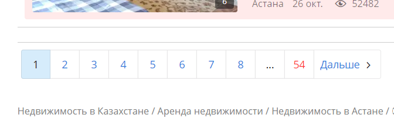

# krisha.kz Scrapy parser
-----------------------

This script parses prices on real estate at https://krisha.kz for further analysing.

Running script
--------------
To start parsing you need scrapy installed:

`pip install scrapy`

1.  Go to https://krisha.kz and set parameters you need:

2.  Click on “Показать результаты”

3.  Copy a link of this page(Chrome: Ctrl+L, then Ctrl+C). It will be the
    `base_url` parameter.

4.  Go to the end of the page, find the number of the last page (**54** in this
    example). It will be the `n_pages` parameter.

5.  In command line run:

~~~~~~~~~~~~~~~~~~~~~~~~~~~~~~~~~~~~~~~~~~~~~~~~~~~~~~~~~~~~~~~~~~~~~~~~~~~~~~~~
scrapy crawl prices_spider -a base_url="YOUR_BASE_URL" -a n_pages=YOUR_N_PAGES -O output/test.json
~~~~~~~~~~~~~~~~~~~~~~~~~~~~~~~~~~~~~~~~~~~~~~~~~~~~~~~~~~~~~~~~~~~~~~~~~~~~~~~~

 

Setting delay
-------------

By default script handles 1 page per 3 sec. Delay is made to don’t get muted or
banned by krisha.kz. You can change this parameter in `krisha/settings.py` by
setting `DOWNLOAD_DELAY`.

**Caution:** if you are parsing many pages at once (10+), you better don’t
change this delay.

---
## My analysis for Astana and Almaty
*(from [rent_price_analysis.ipynb](rent_price_analysis.ipynb))*

Some results I've got after analysing appartments for a rent in Astana and
Almaty:

Long-term rent:
 

 
Short-term rent:
 

