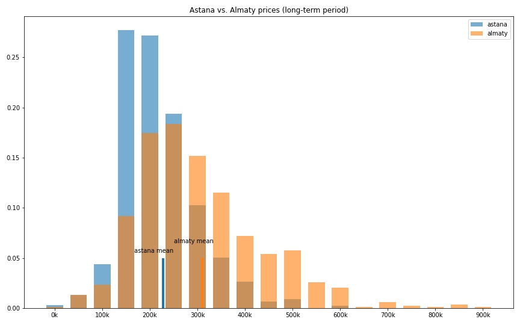
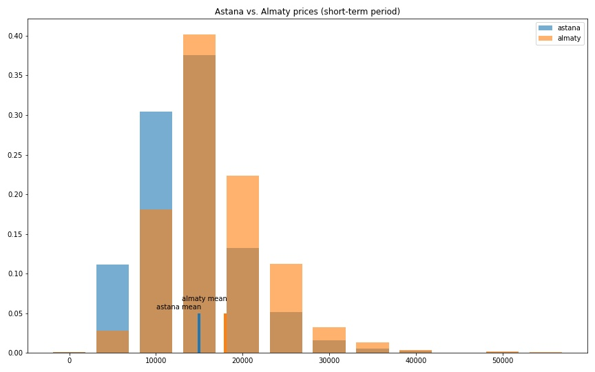

## krisha.kz Scrapy parser
Parses prices on real estate at https://krisha.kz for further analysing.

Some results I've got after anasysing appartments for a rent in Astana and Almaty:




To start parse you need scrapy installed:

```pip install scrapy```

---
## Running script
```
cd krisha.kz-parser
scrapy crawl my_spider -O output/result.json
```